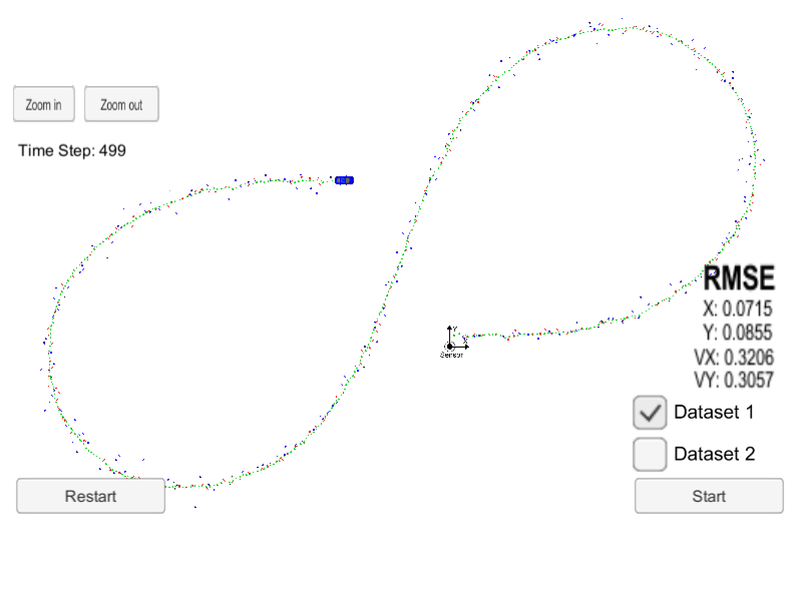

# Unscented Kalman Filter Project 
Self-Driving Car Engineer Nanodegree Program

In this project utilize an Unscented Kalman Filter to estimate the state of a moving object of interest with noisy lidar and radar measurements. 
Passing the project requires obtaining RMSE values that are lower that the tolerance outlined in the project rubric. 

## Basic Build Instructions

1. Clone this repo.
2. Make a build directory: `mkdir build && cd build`
3. Compile: `cmake .. && make`
4. Run it: `./UnscentedKF` Previous versions use i/o from text files.  The current state uses i/o
from the simulator.

## Rubric Requirements

* Compiling
	* Code compiles without errors with cmake and make.
* Accuracy
	* px, py, vx, vy output coordinates have RMSE values less than or equal to [.09, .10, 0.40, 0.30] as shown in visualization below

## Visualization

INPUT: values provided by the simulator to the c++ program

["sensor_measurement"] => the measurment that the simulator observed (either lidar or radar)

OUTPUT: values provided by the c++ program to the simulator

["estimate_x"] <= kalman filter estimated position x
["estimate_y"] <= kalman filter estimated position y
["rmse_x"]
["rmse_y"]
["rmse_vx"]
["rmse_vy"]

